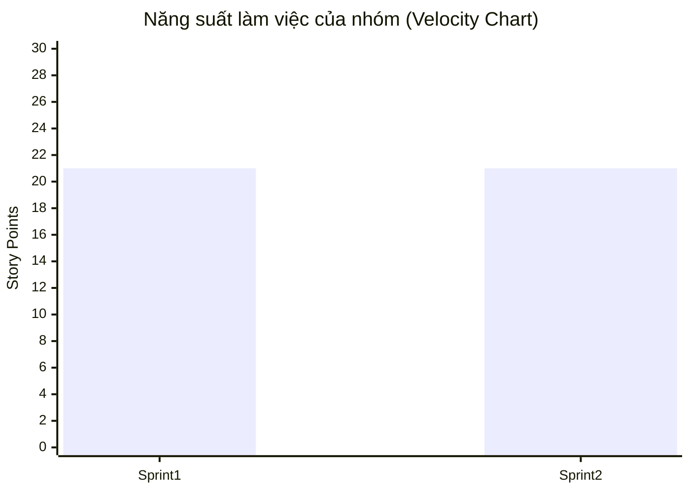

# Agile Metrics & Time Tracking - Website Mua Vé Xem Phim

Tài liệu này lưu trữ các số liệu quản lý dự án (Agile Metrics), ước lượng thời gian và theo dõi hiệu suất làm việc của nhóm qua 2 Sprints.

---

## 1. Quy trình ước lượng Story Points (Planning Poker)
Nhóm áp dụng phương pháp **Planning Poker** với dãy số Fibonacci rút gọn (1, 2, 3, 5, 8, 13) để chấm điểm cho các User Stories dựa trên 3 tiêu chí:
1.  **Độ phức tạp** (Complexity of logic)
2.  **Khối lượng công việc** (Amount of work)
3.  **Mức độ rủi ro/chưa rõ ràng** (Risk or uncertainty)

*   **1 - 2 SP:** Task rất đơn giản, giao diện tĩnh hoặc cấu hình cơ bản.
*   **3 - 5 SP:** Task có logic nghiệp vụ trung bình, cần kết nối API, database.
*   **8 SP:** Task cốt lõi, logic phức tạp, yêu cầu bảo mật cao hoặc xử lý đồng thời (như Redis Lock, tích hợp cổng thanh toán).

---

## 2. Bảng theo dõi thời gian thực tế (Time Tracking)

Dưới đây là bảng tổng hợp giờ ước lượng (Estimated Hours - Est) và giờ thực tế làm việc (Actual Hours - Act) của từng thành viên trong suốt dự án.

### Sprint 1
| Task ID | Thành viên phụ trách | Nhiệm vụ chính | Est (Giờ) | Act (Giờ) | Chênh lệch |
| :--- | :---: | :--- | :---: | :---: | :---: |
| **TS1-BE-01** | T. M. Thuận (SM) | Thiết kế Database Schema | 6 | 5 | -1 |
| **TS1-BE-03** | T. M. Thuận (SM) | API Phim/Suất chiếu | 12 | 14 | +2 |
| **TS1-BE-06** | T. M. Thuận (SM) | API Lock ghế Redis | 16 | 18 | +2 |
| **TS1-BE-08** | T. M. Thuận (SM) | Script Integration Test | 8 | 8 | 0 |
| **TS1-BE-02** | P. V. Thư (Dev) | Khởi tạo NodeJS Backend & Docker Compose | 10 | 12 | +2 |
| **TS1-BE-04** | P. V. Thư (Dev) | API lấy sơ đồ ghế suất chiếu | 12 | 10 | -2 |
| **TS1-BE-05** | P. V. Thư (Dev) | Module Redis Distributed Lock | 16 | 17 | +1 |
| **TS1-BE-07** | P. V. Thư (Dev) | Event Listener tự động hủy lock | 14 | 16 | +2 |
| **TS1-FE-01** | P. T. Tài (Dev) | Khởi tạo Frontend React/Vite | 8 | 7 | -1 |
| **TS1-FE-03** | P. T. Tài (Dev) | Giao diện sơ đồ ghế Seat Map | 16 | 18 | +2 |
| **TS1-FE-05** | P. T. Tài (Dev) | Ghép API sơ đồ ghế thời gian thực | 14 | 15 | +1 |
| **TS1-FE-07** | P. T. Tài & N. Trâm | Kết nối Websocket / SSE | 12 | 15 | +3 |
| **TS1-FE-02** | N. Trâm (PO) | Thiết kế UI trang chủ & suất chiếu | 10 | 9 | -1 |
| **TS1-FE-04** | N. Trâm (PO) | Zustand state & đếm ngược 5 phút | 14 | 13 | -1 |
| **TS1-FE-06** | N. Trâm (PO) | Ghép API giữ chỗ (lock-seats) | 12 | 11 | -1 |
| **TỔNG CỘNG**| | | **180** | **188** | **+8** |

#### Chi tiết phân bổ giờ thực tế (Actual Spent Hours) Sprint 1
*Bảng này khớp với file Excel Chi_Tiet_Task_Tung_Ngay.xlsx (Day 1 tương ứng 15/07, Day 10 tương ứng 28/07).*

| Task | Tổng giờ | D1 | D2 | D3 | D4 | D5 | D6 | D7 | D8 | D9 | D10 |
| :--- | :---: | :---: | :---: | :---: | :---: | :---: | :---: | :---: | :---: | :---: | :---: |
| **TS1-BE-01** | 6 | 0 | 6 | 0 | 0 | 0 | 0 | 0 | 0 | 0 | 0 |
| **TS1-BE-02** | 10 | 0 | 4 | 6 | 0 | 0 | 0 | 0 | 0 | 0 | 0 |
| **TS1-FE-01** | 8 | 0 | 0 | 8 | 0 | 0 | 0 | 0 | 0 | 0 | 0 |
| **TS1-FE-02** | 10 | 0 | 0 | 1 | 9 | 0 | 0 | 0 | 0 | 0 | 0 |
| **TS1-BE-03** | 12 | 0 | 0 | 0 | 12 | 0 | 0 | 0 | 0 | 0 | 0 |
| **TS1-BE-04** | 12 | 0 | 0 | 0 | 4 | 8 | 0 | 0 | 0 | 0 | 0 |
| **TS1-FE-03** | 16 | 0 | 0 | 0 | 0 | 16 | 0 | 0 | 0 | 0 | 0 |
| **TS1-FE-04** | 14 | 0 | 0 | 0 | 0 | 6 | 8 | 0 | 0 | 0 | 0 |
| **TS1-BE-05** | 16 | 0 | 0 | 0 | 0 | 0 | 16 | 0 | 0 | 0 | 0 |
| **TS1-BE-06** | 16 | 0 | 0 | 0 | 0 | 0 | 1 | 15 | 0 | 0 | 0 |
| **TS1-FE-05** | 14 | 0 | 0 | 0 | 0 | 0 | 0 | 10 | 4 | 0 | 0 |
| **TS1-FE-06** | 12 | 0 | 0 | 0 | 0 | 0 | 0 | 0 | 12 | 0 | 0 |
| **TS1-BE-07** | 14 | 0 | 0 | 0 | 0 | 0 | 0 | 0 | 4 | 10 | 0 |
| **TS1-FE-07** | 12 | 0 | 0 | 0 | 0 | 0 | 0 | 0 | 0 | 10 | 2 |
| **TS1-BE-08** | 8 | 0 | 0 | 0 | 0 | 0 | 0 | 0 | 0 | 0 | 8 |
| **Tổng tiêu hao/Ngày** | **180** | **0** | **10** | **15** | **25** | **30** | **25** | **25** | **20** | **20** | **10** |

### Sprint 2
| Task ID | Thành viên phụ trách | Nhiệm vụ chính | Est (Giờ) | Act (Giờ) | Chênh lệch |
| :--- | :---: | :--- | :---: | :---: | :---: |
| **TS2-BE-01** | T. M. Thuận (SM) | Tích hợp MoMo Sandbox | 16 | 15 | -1 |
| **TS2-BE-03** | T. M. Thuận (SM) | Xử lý Webhook IPN & verify chữ ký | 14 | 14 | 0 |
| **TS2-BE-05** | T. M. Thuận (SM) | Sinh QR Code & Email service | 12 | 11 | -1 |
| **TS2-BE-02** | P. V. Thư (Dev) | Tích hợp VNPay Sandbox | 16 | 17 | +1 |
| **TS2-BE-04** | P. V. Thư (Dev) | DB Transaction đổi trạng thái vé | 12 | 11 | -1 |
| **TS2-BE-06** | P. V. Thư (Dev) | API lịch sử & hủy giữ chỗ sớm | 10 | 10 | 0 |
| **TS2-FE-01** | P. T. Tài (Dev) | UI tóm tắt hóa đơn chọn cổng | 10 | 9 | -1 |
| **TS2-FE-03** | P. T. Tài (Dev) | Xử lý redirect MoMo/VNPay | 12 | 11 | -1 |
| **TS2-FE-05** | P. T. Tài & N. Trâm | Ghép API Lịch sử & Hủy đặt vé | 12 | 11 | -1 |
| **TS2-FE-02** | N. Trâm (PO) | UI Success/Failure & hiển thị QR | 12 | 13 | +1 |
| **TS2-FE-04** | N. Trâm (PO) | UI trang Lịch sử đặt vé | 14 | 13 | -1 |
| **TS2-FE-06** | Cả Scrum Team | E2E Testing toàn luồng & viết API doc | 16 | 15 | -1 |
| **TỔNG CỘNG**| | | **156** | **150** | **-6** |

#### Chi tiết phân bổ giờ thực tế (Actual Spent Hours) Sprint 2
*Bảng này khớp với file Excel Chi_Tiet_Task_Tung_Ngay.xlsx (Day 1 tương ứng 03/08, Day 10 tương ứng 14/08).*

| Task | Tổng giờ | D1 | D2 | D3 | D4 | D5 | D6 | D7 | D8 | D9 | D10 |
| :--- | :---: | :---: | :---: | :---: | :---: | :---: | :---: | :---: | :---: | :---: | :---: |
| **TS2-BE-01** | 16 | 15 | 1 | 0 | 0 | 0 | 0 | 0 | 0 | 0 | 0 |
| **TS2-BE-02** | 16 | 0 | 14 | 2 | 0 | 0 | 0 | 0 | 0 | 0 | 0 |
| **TS2-FE-01** | 10 | 0 | 0 | 10 | 0 | 0 | 0 | 0 | 0 | 0 | 0 |
| **TS2-FE-02** | 12 | 0 | 0 | 3 | 9 | 0 | 0 | 0 | 0 | 0 | 0 |
| **TS2-BE-03** | 14 | 0 | 0 | 0 | 6 | 8 | 0 | 0 | 0 | 0 | 0 |
| **TS2-BE-04** | 12 | 0 | 0 | 0 | 0 | 8 | 4 | 0 | 0 | 0 | 0 |
| **TS2-FE-03** | 12 | 0 | 0 | 0 | 0 | 0 | 12 | 0 | 0 | 0 | 0 |
| **TS2-FE-04** | 14 | 0 | 0 | 0 | 0 | 0 | 0 | 14 | 0 | 0 | 0 |
| **TS2-BE-05** | 12 | 0 | 0 | 0 | 0 | 0 | 0 | 2 | 10 | 0 | 0 |
| **TS2-FE-05** | 12 | 0 | 0 | 0 | 0 | 0 | 0 | 0 | 6 | 6 | 0 |
| **TS2-BE-06** | 10 | 0 | 0 | 0 | 0 | 0 | 0 | 0 | 0 | 10 | 0 |
| **TS2-FE-06** | 16 | 0 | 0 | 0 | 0 | 0 | 0 | 0 | 0 | 0 | 16 |
| **Tổng tiêu hao/Ngày** | **156** | **15** | **15** | **15** | **15** | **16** | **16** | **16** | **16** | **16** | **16** |

---

## 3. Biểu đồ Burndown Chart (Tiến độ thực tế)

### Sprint 1 Burndown (21 Story Points)
Biểu đồ thể hiện sự sụt giảm của khối lượng công việc còn lại (Remaining SP) theo 10 ngày làm việc của Sprint 1.

```mermaid
gantt
    title Sprint 1 Burndown Chart (Story Points)
    dateFormat  X
    axisFormat %d
    
    section Lý thuyết (Kế hoạch)
    Điểm lý thuyết còn lại : active, 0, 10
    
    section Thực tế hoàn thành
    Ngày 1-2 (Khởi tạo DB & Project) : done, 0, 2
    Ngày 3-5 (Vẽ Seat Map & API cơ bản) : done, 2, 5
    Ngày 6-8 (Redis Lock & countdown timer) : done, 5, 8
    Ngày 9-10 (WebSocket E2E & Concurrency Test) : done, 8, 10
```

*   **Nhận xét:** Trong 3 ngày đầu, tiến độ hơi chậm do phải setup môi trường Docker và sửa lỗi CORS. Từ ngày thứ 5 trở đi sau khi đã thông suốt API, tốc độ hoàn thành công việc của nhóm tăng vọt và kết thúc Sprint 1 đúng hạn.

### Sprint 2 Burndown (21 Story Points)
Biểu đồ thể hiện sự sụt giảm của khối lượng công việc còn lại (Remaining SP) theo 10 ngày làm việc của Sprint 2.

```mermaid
gantt
    title Sprint 2 Burndown Chart (Story Points)
    dateFormat  X
    axisFormat %d
    
    section Lý thuyết (Kế hoạch)
    Điểm lý thuyết còn lại : active, 0, 10
    
    section Thực tế hoàn thành
    Ngày 1-3 (UI & API Lịch sử, Tóm tắt Hóa đơn) : done, 0, 3
    Ngày 4-6 (Tích hợp MoMo & VNPay Sandbox) : done, 3, 6
    Ngày 7-8 (Xử lý Webhook IPN & QR Code) : done, 6, 8
    Ngày 9-10 (E2E Testing & API Docs) : done, 8, 10
```

*   **Nhận xét:** Ở Sprint 2, tiến độ trơn tru và đều đặn hơn nhờ nhóm đã làm quen với môi trường và có cải tiến từ Sprint 1. Các ngày cuối hoàn thiện E2E testing tốt giúp dự án hoàn thành đúng hạn.

---

## 4. Tốc độ làm việc của nhóm (Velocity Chart)
Biểu đồ so sánh lượng Story Points hoàn thành giữa 2 Sprints.

*   **Phân tích:** 
    *   Cả hai Sprint đều hoàn thành xuất sắc 100% mục tiêu cam kết (21 Story Points/Sprint).
    *   Ở Sprint 2, dù khối lượng kỹ thuật tích hợp cổng thanh toán rất phức tạp, nhưng nhờ rút kinh nghiệm từ Sprint 1 (áp dụng Postman Shared Workspace và họp daily buổi sáng sớm), nhóm đã tiêu tốn ít thời gian thực tế hơn (150 giờ so với 188 giờ ở Sprint 1) để hoàn thành cùng số lượng Story Points.
