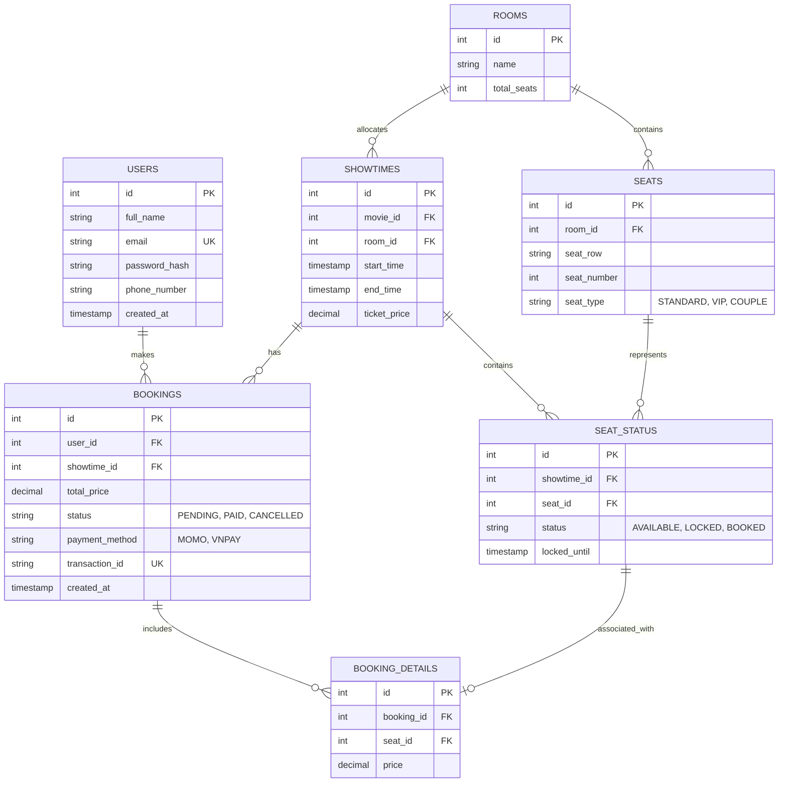

# Database Schema - Website Mua Vé Xem Phim

Tài liệu này đặc tả cấu trúc cơ sở dữ liệu quan hệ (PostgreSQL) phục vụ cho dự án.

## 1. Sơ đồ thực thể quan hệ (ERD Diagram)

---

## 2. Đặc tả các bảng chi tiết

### Bảng `users` (Quản lý người dùng)
*   `id`: SERIAL PK
*   `full_name`: VARCHAR(100) NOT NULL
*   `email`: VARCHAR(100) UNIQUE NOT NULL
*   `password_hash`: VARCHAR(255) NOT NULL
*   `phone_number`: VARCHAR(15)
*   `created_at`: TIMESTAMP DEFAULT CURRENT_TIMESTAMP

### Bảng `rooms` (Phòng chiếu)
*   `id`: SERIAL PK
*   `name`: VARCHAR(50) NOT NULL
*   `total_seats`: INT NOT NULL

### Bảng `seats` (Danh sách ghế vật lý)
*   `id`: SERIAL PK
*   `room_id`: INT FK -> `rooms(id)` ON DELETE CASCADE
*   `seat_row`: VARCHAR(2) NOT NULL (Ví dụ: 'A', 'B', 'C')
*   `seat_number`: INT NOT NULL (Ví dụ: 1, 2, 3)
*   `seat_type`: VARCHAR(20) DEFAULT 'STANDARD' ('STANDARD', 'VIP', 'COUPLE')

### Bảng `showtimes` (Suất chiếu)
*   `id`: SERIAL PK
*   `movie_id`: INT NOT NULL (Liên kết ID phim)
*   `room_id`: INT FK -> `rooms(id)`
*   `start_time`: TIMESTAMP NOT NULL
*   `end_time`: TIMESTAMP NOT NULL
*   `ticket_price`: DECIMAL(10, 2) NOT NULL

### Bảng `seat_status` (Trạng thái ghế của suất chiếu - Quan trọng cho Concurrency)
*   `id`: SERIAL PK
*   `showtime_id`: INT FK -> `showtimes(id)` ON DELETE CASCADE
*   `seat_id`: INT FK -> `seats(id)` ON DELETE CASCADE
*   `status`: VARCHAR(20) DEFAULT 'AVAILABLE' ('AVAILABLE', 'LOCKED', 'BOOKED')
*   `locked_until`: TIMESTAMP NULL (Thời gian khóa ghế, bằng thời gian bắt đầu khóa + 5 phút)

### Bảng `bookings` (Thông tin hóa đơn đặt vé)
*   `id`: SERIAL PK
*   `user_id`: INT FK -> `users(id)`
*   `showtime_id`: INT FK -> `showtimes(id)`
*   `total_price`: DECIMAL(10, 2) NOT NULL
*   `status`: VARCHAR(20) DEFAULT 'PENDING' ('PENDING', 'PAID', 'CANCELLED')
*   `payment_method`: VARCHAR(20) NULL ('MOMO', 'VNPAY')
*   `transaction_id`: VARCHAR(100) UNIQUE NULL (Mã giao dịch trả về từ cổng thanh toán)
*   `created_at`: TIMESTAMP DEFAULT CURRENT_TIMESTAMP

---

## 3. Chiến lược đánh Index để tối ưu hóa hiệu năng
Để đảm lý lượng truy cập đồng thời lớn khi đặt vé, các Index sau được tạo:
*   `CREATE INDEX idx_seat_status_showtime ON seat_status(showtime_id);` -> Tối ưu API lấy sơ đồ ghế theo suất chiếu.
*   `CREATE UNIQUE INDEX idx_seat_status_concurrency ON seat_status(showtime_id, seat_id);` -> Ngăn chặn trùng lặp ghế ở mức Database.
*   `CREATE INDEX idx_bookings_user ON bookings(user_id);` -> Tối ưu API xem lịch sử mua vé.
